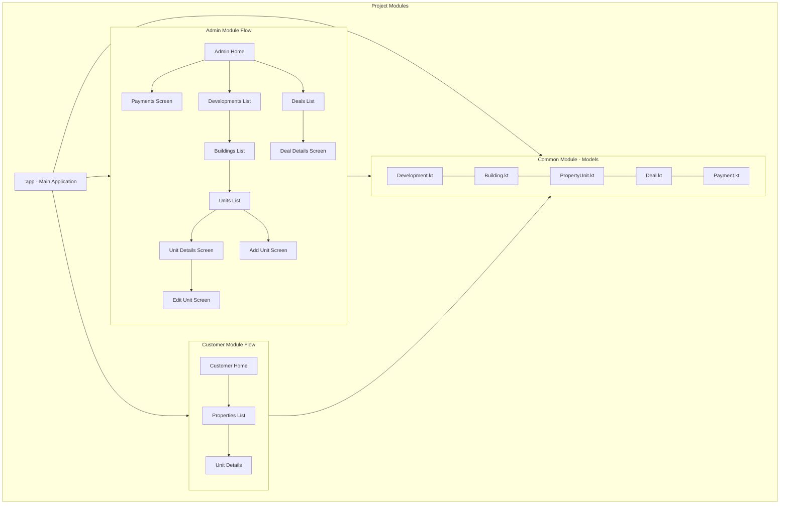

# 🏢 PropVault

## Real Estate Customer Relationship Management Application

  

## 📱 What It Does

Property CRM is a comprehensive real estate management solution designed for property development companies. The application streamlines the process of managing developments, buildings, units, deals, and payments through an intuitive interface. It features:

* **Single Admin Portal**: Centralized management system for property administrators
* **Multiple Customer Access**: Allowing potential buyers to browse available properties
* **End-to-End Deal Management**: From property listing to payment tracking
* **Real-time Updates**: Using Firebase for instant data synchronization

### Key Features

#### For Admin (Single Access)
- **Comprehensive Development Management**: Create and manage multiple real estate developments
- **Hierarchical Building Structure**: Organize buildings within developments
- **Unit Management**: Track property units with detailed information and pricing
- **Deal Tracking**: Monitor all property deals from initiation to closing
- **Payment Processing**: Keep track of all payment transactions

#### For Customers (Multiple Users)
- **Property Exploration**: Browse available developments and units
- **Detailed Unit Information**: Access comprehensive details about potential properties
- **Streamlined Viewing Experience**: Intuitive navigation through property listings

## 🛠️ How It's Built

### Architecture

Property CRM follows a multi-module architecture with clean separation of concerns:

- **:app**: Main application module that connects all components
- **:admin**: Contains admin-specific features and interfaces
- **:common**: Shared models, utilities, and core logic
- **:customer**: Customer-facing screens and features

### Tech Stack

- **Language**: 100% Kotlin
- **UI Framework**: Jetpack Compose
- **Architecture**: MVVM + Clean Architecture
- **Backend**: Firebase (Firestore, Authentication)
- **Async Operations**: Kotlin Coroutines with Flow
- **Dependency Injection**: Koin
- **Navigation**: Jetpack Navigation Compose

### Core Models

The application is built around five main data models:

1. **Development**: Real estate development projects
2. **Building**: Structures within developments
3. **PropertyUnit**: Individual units available for purchase
4. **Deal**: Sales transactions with customers
5. **Payment**: Financial transactions related to deals

### Application Flow

## ⚠️ Limitations

- Currently limited to Android platform only
- Offline functionality is limited; requires internet connection for most features
- No multi-language support at this stage
- Limited reporting and analytics capabilities
- No integration with external payment gateways

## 🚀 Future Roadmap

### Short-term Goals
- Add comprehensive unit testing
- Implement offline caching for better connectivity handling
- Add document management for property contracts
- Enhance UI with animations and transitions

### Long-term Vision
- Expand to iOS using Kotlin Multiplatform
- Implement advanced analytics dashboard
- Add integrated chat functionality between admin and customers
- Integrate with popular CRM systems for data synchronization
- Add AI-powered recommendations for potential buyers

## 📥 Installation

1. Download the APK from [here](link-to-your-apk)
2. Enable installation from unknown sources in your Android settings
3. Install the application
4. Log in as admin or browse as a customer

  For admin use username: admin and password: password
  
## 🎬 Demo

Check out the [video demonstration](link-to-your-video) to see Property CRM in action!

## 📋 Requirements

- Android 8.0 (API level 26) or higher
- Internet connection
  
---

  Made with ❤️ by Prafull Kumar

